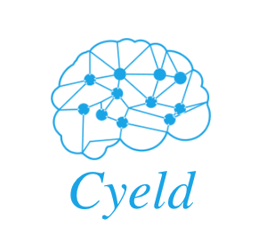

    

## About Cyeld

> **Note:** This repository contains the core code of the Cyeld framework. If you want to build an application using Cyeld, visit the main .

Cyeld is a web application framework with expressive, elegant syntax. We believe development must be an enjoyable, creative experience to be truly fulfilling. Cyeld attempts to take the pain out of development by easing common tasks used in the majority of web projects, such as:
